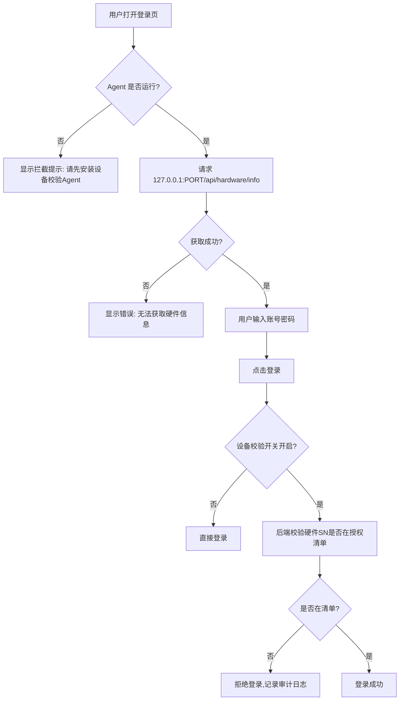

```mermaid
graph TB
    A[用户打开登录页] --> B{Agent 是否运行?}
    B -->|否| C[显示拦截提示: 请先安装设备校验Agent]
    B -->|是| D[请求 127.0.0.1:PORT/api/hardware/info]
    D --> E{获取成功?}
    E -->|否| F[显示错误: 无法获取硬件信息]
    E -->|是| G[用户输入账号密码]
    G --> H[点击登录]
    H --> I{设备校验开关开启?}
    I -->|否| J[直接登录]
    I -->|是| K[后端校验硬件SN是否在授权清单]
    K --> L{是否在清单?}
    L -->|否| M[拒绝登录,记录审计日志]
    L -->|是| N[登录成功]
```